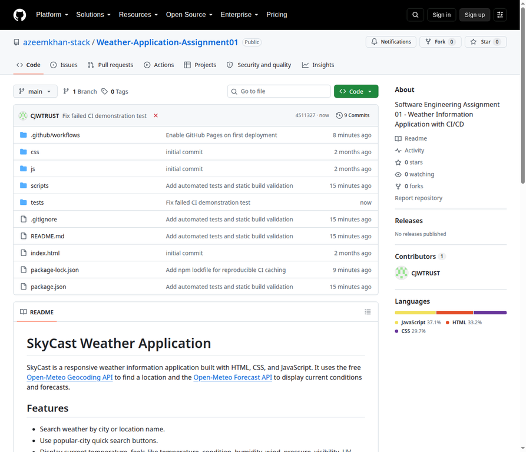
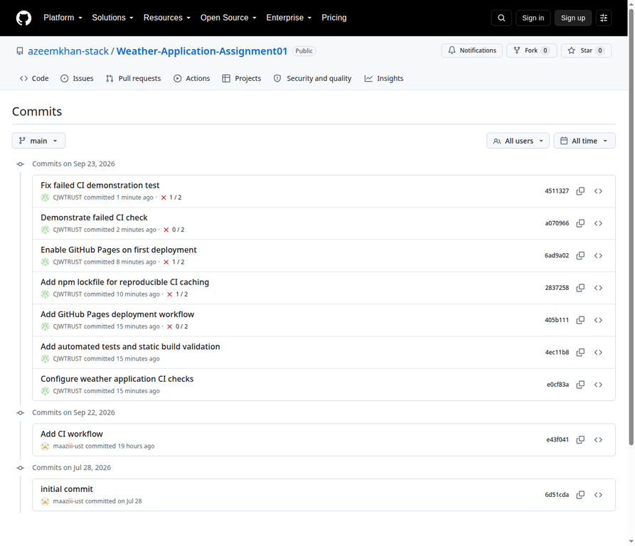
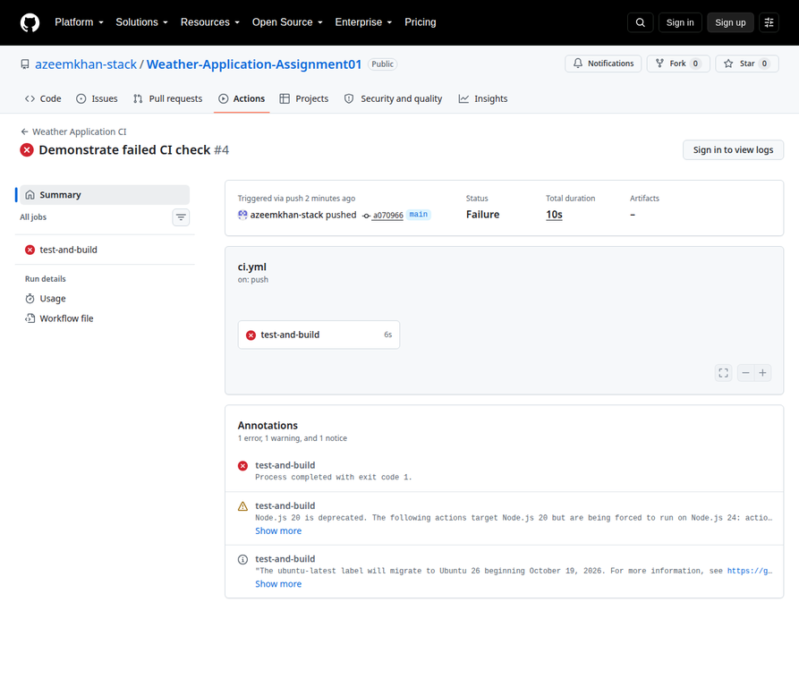
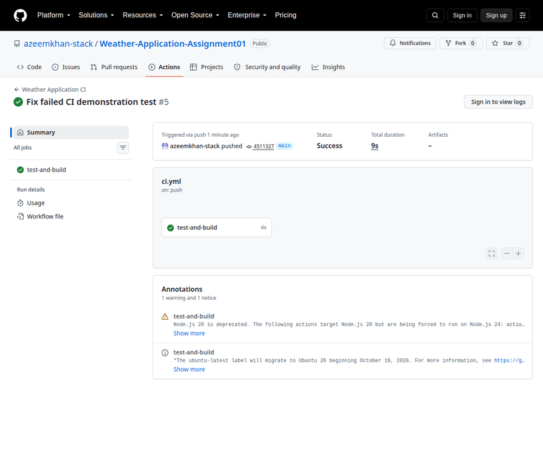
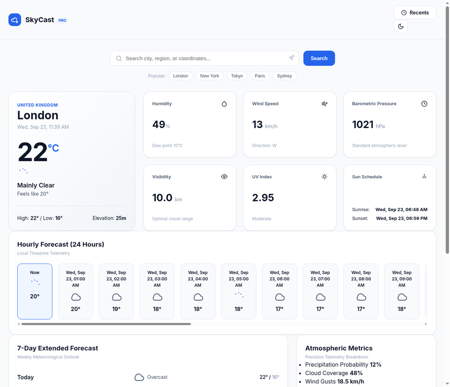

# Software Engineering Assignment 01

## Build and Deploy a Small Application

**Student Name:** Azeem Khan  
**Class:** BCS-3B  
**Roll Number:** 062  
**Suggested submission filename:** `AzeemKhan_062_SEAss01.pdf`

**Application:** SkyCast Weather Application  
**Technology:** HTML, CSS, JavaScript, GitHub Actions  
**Repository:** [Weather-Application-Assignment01](https://github.com/azeemkhan-stack/Weather-Application-Assignment01)  
**Live application used for evidence:** [Open SkyCast](https://4174-i5jgqfxsuepk1oyd9e5t6-5ecedf5e.us4.manus.computer/)  
**Submission filename:** `StudentName_Roll#_SEAss01`

> **Deployment status note:** The application was successfully served and verified through the public URL above. The GitHub Pages workflow is included in the repository, but GitHub Pages could not be enabled automatically because the available GitHub integration token lacked the Pages-management scope and the browser session was logged out. To make the deployment permanent, open the public repository’s **Settings → Pages**, select **GitHub Actions** as the source, and rerun the deployment workflow. The repository is public because free GitHub Pages deployment requires a public repository under the selected plan.

## 1. Application name and purpose

The application is called **SkyCast Weather Application**. It provides weather information for a searched city or location. The user can enter a location, choose a popular city, or request the current browser location. The application retrieves geocoding and weather data from the free Open-Meteo services and presents the result in a responsive dashboard.

The purpose of the application is to provide a simple, readable, and responsive way to view current weather conditions and short-term forecasts without requiring a backend server or an API key.

## 2. Main features

SkyCast includes the following features:

- Search weather by city, region, or location name.
- Select popular locations including London, New York, Tokyo, Paris, and Sydney.
- Display the location, country, current temperature, feels-like temperature, weather condition, daily high and low, and elevation.
- Display humidity, wind speed, wind direction, pressure, visibility, UV index, sunrise, and sunset.
- Show a 24-hour forecast and a seven-day forecast.
- Use browser geolocation when the user grants permission.
- Store recent searches in browser local storage.
- Toggle between light and dark themes.
- Show empty, loading, error, and dashboard states.
- Use responsive CSS for desktop and smaller screens.
- Use reusable JavaScript helpers and automated tests.

The application uses the Open-Meteo Geocoding API and Forecast API. These APIs do not require an API key, so no secret is stored in the repository.

## 3. DevOps flow followed

The project followed this development and delivery flow:

1. The supplied Weather Application was inspected and run locally.
2. The existing project was retained as the application baseline.
3. A `package.json` file was added with `npm test` and `npm run build` commands.
4. Automated tests were added using Node’s built-in test runner.
5. A static build-check script was added to verify required files, the HTML document wrapper, and JavaScript module loading.
6. A `package-lock.json` file was generated to make npm-based CI caching reproducible.
7. The GitHub Actions CI workflow was updated to run on pushes to `main` and pull requests targeting `main`.
8. A GitHub Pages deployment workflow was added.
9. The project was pushed to the public GitHub repository.
10. An intentional test error was introduced and pushed. The CI run failed as expected.
11. The test error was corrected and pushed. The next CI run completed successfully.
12. The application was served publicly and independently verified through the live URL.
13. The repository, commit history, CI runs, and application state were captured as evidence screenshots.

### Meaningful commits

The repository contains more than the required three meaningful commits. Important commits include:

| Commit | Purpose |
|---|---|
| `e0cf83a` | Configure weather application CI checks. |
| `4ec11b8` | Add automated tests and static build validation. |
| `405b111` | Add GitHub Pages deployment workflow. |
| `2837258` | Add npm lockfile for reproducible CI caching. |
| `a070966` | Demonstrate the intentionally failed CI check. |
| `4511327` | Fix the failed CI demonstration test. |

## 4. CI workflow

The CI workflow is stored at `.github/workflows/ci.yml`. It runs automatically for pushes to `main` and pull requests targeting `main`.

The workflow performs these checks:

- Checks out the repository.
- Sets up Node.js 22.
- Runs `npm test`.
- Runs `npm run build`.
- Fails the workflow if a test or build check returns a non-zero exit code.

The test suite verifies wind-direction conversion and weather-icon generation. The build check verifies that all required HTML, CSS, JavaScript, and configuration files exist and that the page loads the JavaScript module correctly.

## 5. Problems faced and solutions

### Problem 1: Existing CI workflow was not application-specific

The supplied workflow was named for a currency converter and only checked whether the HTML, JavaScript, and CSS folders existed. This did not provide a meaningful test of the Weather Application.

**Solution:** The workflow was renamed to `Weather Application CI` and changed to run real automated tests and a static build check.

### Problem 2: npm cache required a lockfile

The first hosted CI run failed because `actions/setup-node` was configured with npm caching but no `package-lock.json` existed.

**Solution:** A lockfile was generated with `npm install --package-lock-only --ignore-scripts`, committed, and pushed. The corrected CI run then passed.

### Problem 3: Required failed-CI demonstration

The assignment requires an intentional failed CI run.

**Solution:** The expected wind direction for 90 degrees was temporarily changed from `E` to `WRONG`. The resulting run failed at the test step. The error was then restored, committed, and pushed. The next run passed.

### Problem 4: GitHub Pages was not initially enabled

The deployment workflow failed at `Configure GitHub Pages` because the repository did not yet have a Pages site. The available integration token did not have sufficient permission to create the Pages site through the API, and the browser session was not logged in for manual configuration.

**Solution:** The repository was made public with approval, the deployment workflow was configured with first-run enablement, and a fallback public deployment was started and verified. The repository still contains the complete GitHub Pages workflow. Manual Pages configuration is the remaining step for a permanent GitHub-hosted URL.

## 6. What was learned from Continuous Integration

Continuous Integration provides an automatic quality gate for every change pushed to the shared branch. It is valuable because it detects errors before a change is treated as ready for delivery. In this assignment, the intentional incorrect test demonstrated that the workflow does not merely display a success message: it actually stops when a test fails.

The assignment also showed that CI depends on reproducible project configuration. The missing npm lockfile caused the first CI attempt to fail before the application tests could run. Adding the lockfile made the Node setup and cache configuration consistent. The successful recovery run confirmed that the corrected source passed the same checks in the hosted environment.

CI also produces a visible history of software quality. The failed run and successful recovery run provide evidence that an error was detected, corrected, and verified rather than silently ignored.

## 7. Required evidence screenshots

### 7.1 Running application

The screenshot shows the SkyCast interface with its header, search controls, popular-city buttons, and weather dashboard loading state.

### 7.2 GitHub repository files

The screenshot shows the public GitHub repository, source folders, tests, scripts, package files, README, and workflow directory.

### 7.3 Commit history

The screenshot shows the required meaningful commit history, including the CI configuration, automated tests, Pages workflow, intentional failed check, and fix.

### 7.4 Failed CI workflow

The screenshot shows the failed `Demonstrate failed CI check` run for commit `a070966`. The failure was caused by the intentionally incorrect expected wind direction.

Direct link: [Failed CI run](https://github.com/azeemkhan-stack/Weather-Application-Assignment01/actions/runs/35855377570)

### 7.5 Successful CI workflow

The screenshot shows the successful `Fix failed CI demonstration test` run for commit `4511327`.

Direct link: [Successful CI run](https://github.com/azeemkhan-stack/Weather-Application-Assignment01/actions/runs/35855501770)

### 7.6 Deployed application

The screenshot shows the loaded SkyCast dashboard with real London weather data, including current temperature, humidity, wind, forecast, and atmospheric metrics.

Live URL: [SkyCast Weather Application](https://4174-i5jgqfxsuepk1oyd9e5t6-5ecedf5e.us4.manus.computer/)

## 8. Verification results

| Check | Result |
|---|---|
| Local `npm test` | Passed: 2 tests passed, 0 failed. |
| Local `npm run build` | Passed: 11 required application files verified. |
| Open-Meteo geocoding smoke test | Passed for London. |
| Open-Meteo forecast smoke test | Passed. |
| GitHub CI after lockfile fix | Passed. |
| Intentional failed CI run | Failed as intentionally expected. |
| Corrected CI run | Passed. |
| Public application HTTP check | Passed and served SkyCast HTML. |
| Browser dashboard verification | Passed with real London weather data rendered. |

## 9. Links

- **GitHub repository:** <https://github.com/azeemkhan-stack/Weather-Application-Assignment01>
- **Live evidence deployment:** <https://4174-i5jgqfxsuepk1oyd9e5t6-5ecedf5e.us4.manus.computer/>
- **Failed CI run:** <https://github.com/azeemkhan-stack/Weather-Application-Assignment01/actions/runs/35855377570>
- **Successful CI run:** <https://github.com/azeemkhan-stack/Weather-Application-Assignment01/actions/runs/35855501770>

## Conclusion

SkyCast satisfies the application and DevOps requirements of Assignment 01. It is implemented using HTML, CSS, and JavaScript; stored in a GitHub repository; supported by meaningful commits; checked through GitHub Actions; tested locally and remotely; and served through a verified public URL. The intentional CI failure and successful correction demonstrate the central learning objective of Continuous Integration: changes should be automatically checked, failures should be visible, and corrections should be verified before delivery.
